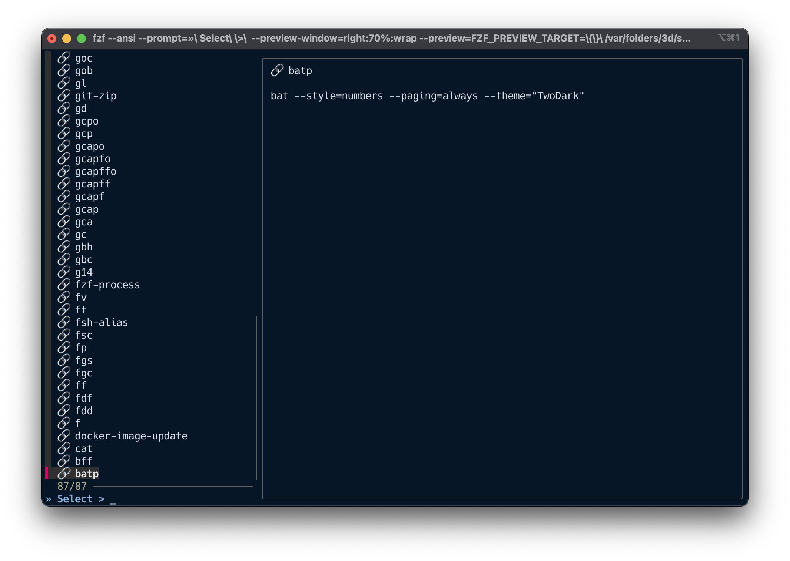

# 🚀 Fzf Tools: Interactive CLI Navigator

Fzf Tools is a modular, keyboard-driven launcher that lets you browse and act on files, Git status,
processes, and shell history using fuzzy search. It’s designed for developers who want quick,
contextual interactions directly from the terminal.

---

## 📦 Use Cases

- Open recently changed files in your editor via Git commit inspection
- Jump into any directory by previewing structure with `eza`
- Preview file contents with syntax highlighting using `bat`
- Search and replay shell history or kill processes interactively
- Integrate `fzf-tools` into aliases or scripts as a structured subcommand

---

## 🛠 Commands

### `fzf-tools env`

🌱 Browse environment variables with fuzzy search and preview

```bash
fzf-tools env [query]
```

Each environment variable is shown with its full value for quick inspection or copying.
If provided, `query` pre-fills the initial fzf search input.


---

### `fzf-tools alias`

🔗 Browse and inspect defined shell aliases

```bash
fzf-tools alias [query]
```

See your configured shortcuts in one place, with real evaluated output.
If provided, `query` pre-fills the initial fzf search input.



---

### `fzf-tools function`

🔧 View loaded shell functions with source content

```bash
fzf-tools function [query]
```

Lists all functions in your shell session and shows their implementation.
If provided, `query` pre-fills the initial fzf search input.


---

### `fzf-tools def`

📦 Explore all shell definitions (env, alias, functions)

```bash
fzf-tools def [query]
```

Aggregate view of your shell environment: useful for debugging or reviewing your Zsh config state.
If provided, `query` pre-fills the initial fzf search input.


---

### `fzf-tools git-commit`

🔍 Browse commit history, preview files in any commit, and open in an editor

```bash
fzf-tools git-commit [--snapshot] [query]
```

Optionally pass a query to pre-fill the initial fuzzy search. If the input also resolves to a commit ref
(e.g. `HEAD~1`), it will be converted to its short hash to seed the search.

By default, press `Enter` to open multiple files from the current working tree (worktree) at the same paths as in
the selected commit (limited by `OPEN_CHANGED_FILES_MAX_FILES`).
Press `Ctrl-F` to open the selected file only; if that path no longer exists, you’ll be prompted to open the commit
snapshot instead. For deleted files, the snapshot opens the pre-delete version from the parent commit.
With `--snapshot`, press `Enter` to open the selected file snapshot; press `Ctrl-F` to open the selected worktree file.

**Preview includes:**

- `bat`-highlighted file content
- Commit-specific snapshot
- Open files in your editor (`Enter`: multiple worktree files; `Ctrl-F`: selected file; `--snapshot`: selected snapshot)

### 🧭 Two-step interaction

1. **Step 1: Pick a commit**  
   Use fuzzy search to select a commit from your history.  
   The right panel previews the full commit scope (message, files, stats).

2. **Step 2: Pick a file**  
   After selecting a commit, choose a modified file.  
   The preview shows a colorized `git diff` via `delta`.  
   Press `Enter` to open multiple files from the current working tree (worktree).  
   Press `Ctrl-F` to open the selected file only. (With `--snapshot`, `Enter` opens the snapshot and `Ctrl-F` opens the worktree file.)

#### 📌 Step 1: Commit selection with scope preview


#### 📄 Step 2: File selection with diff preview


> Press `Enter` to open multiple worktree files (default) or the selected snapshot (`--snapshot`).  
> Press `Ctrl-F` to open the selected file only (worktree).  
> Configure `FZF_FILE_OPEN_WITH` to choose the opener: `vi` (default) or `vscode`.  
> Use `--snapshot` to always open the selected file snapshot (exported to a temp file). (Multi-file open is worktree only.)

---

### `fzf-tools git-status`

📂 Pick and preview modified files from `git status`

```bash
fzf-tools git-status [query]
```

Shows inline diffs and lets you quickly inspect file changes.
Preview includes staged / unstaged diffs, and untracked files are shown as additions.
If provided, `query` pre-fills the initial fzf search input.

---

### `fzf-tools git-checkout`

🌀 Checkout a previous commit using fuzzy log navigation

```bash
fzf-tools git-checkout [query]
```

Select a past commit and checkout to it. If local changes block it, you’ll be prompted to stash.
If provided, `query` pre-fills the initial fzf search input.

---

### `fzf-tools git-branch`

🌿 Browse and checkout Git branches interactively with preview and confirmation

```bash
fzf-tools git-branch [query]
```

Presents a list of local branches, sorted by most recent activity. The current branch is marked with `*`. Use fuzzy search to pick a branch.
If provided, `query` pre-fills the initial fzf search input.

---

### `fzf-tools git-tag`

🏷️  Browse and checkout Git tags interactively with preview and confirmation

```bash
fzf-tools git-tag [query]
```

Lists all tags in your repository, sorted by creation date (most recent first). Use fuzzy search to select a tag.
If provided, `query` pre-fills the initial fzf search input.

---

### `fzf-tools history`

📜 Search and run from recent shell commands

```bash
fzf-tools history [query]
```

Great for recalling complex or recently used one-liners without retyping.
If provided, `query` pre-fills the initial fzf search input.

---

### `fzf-tools directory`

📁 Pick a directory, then browse files inside it

```bash
fzf-tools directory [--vi|--vscode] [query]
```

This is a two-step flow:

1. **Step 1: Pick a directory**  
   Preview directory contents using `eza` (or fallback to `ls`).
   If provided, `query` pre-fills the Step 1 fzf search input.

2. **Step 2: Browse files in that directory**
   Preview file contents using `bat` (or fallback to `sed`).

#### ⌨️ Step 2 keys

- `Enter` / `Ctrl-F`: open the selected file (then exit)
- `Ctrl-D`: `cd` to the selected directory (then exit)
- `Esc`: back to Step 1 (preserves your Step 1 query)

#### ⚙️ Environment variables

- `FZF_FILE_MAX_DEPTH`: max depth for Step 2 file listing (default: `5`)
- `FZF_FILE_OPEN_WITH`: file opener for Step 2 (`vi` default, or `vscode`)

#### ⚙️ Options

- `--vi`: open selected files in `vi` (overrides `FZF_FILE_OPEN_WITH`)
- `--vscode`: open selected files in VSCode (overrides `FZF_FILE_OPEN_WITH`)

Example: open files in VSCode for this run:

```bash
fzf-tools directory --vscode
```

Example: open files in VSCode by default (env var):

```bash
FZF_FILE_OPEN_WITH=vscode fzf-tools directory
```

---

### `fzf-tools file`

📝 Open a file using `vi` (wraps `$EDITOR`) after previewing its contents with `bat`

```bash
fzf-tools file [--vi|--vscode] [query]
```

Search for any file in your project, preview its contents with syntax highlighting, and open it in `vi` (which wraps `$EDITOR`) with one keystroke.
If provided, `query` pre-fills the initial fzf search input.

#### ⚙️ Environment variables

- `FZF_FILE_OPEN_WITH`: file opener (`vi` default, or `vscode`); when `vscode`, uses the nearest Git root (up to 5 parent dirs) as the VSCode workspace root, and opens a new window when switching repos

#### ⚙️ Options

- `--vi`: open the selected file in `vi` (overrides `FZF_FILE_OPEN_WITH`)
- `--vscode`: open the selected file in VSCode (overrides `FZF_FILE_OPEN_WITH`)

Example: open in VSCode for this run:

```bash
fzf-tools file --vscode
```

---

### `fzf-tools process`

🥪 View and inspect running processes (optional kill)

```bash
fzf-tools process [-k|--kill] [-9|--force] [query]
```

Lightweight fallback using `ps` with fuzzy search for diagnostic use.
If provided, `query` pre-fills the initial fzf search input.

#### 🔪 Kill mode

Add `-k` or `--kill` to immediately terminate selected PID(s) (SIGTERM). Add `-9` or `--force` for SIGKILL.

```bash
fzf-tools process -k
```

Useful for terminating frozen or rogue processes.

---

### `fzf-tools port`

🔌 Browse listening TCP ports and owning processes (optional kill)

```bash
fzf-tools port [-k|--kill] [-9|--force] [query]
```

If provided, `query` pre-fills the initial fzf search input.

#### 🔪 Kill mode

Add `-k` or `--kill` to immediately kill the owning PID(s). Add `-9` or `--force` to use SIGKILL.

```bash
fzf-tools port -k
```
