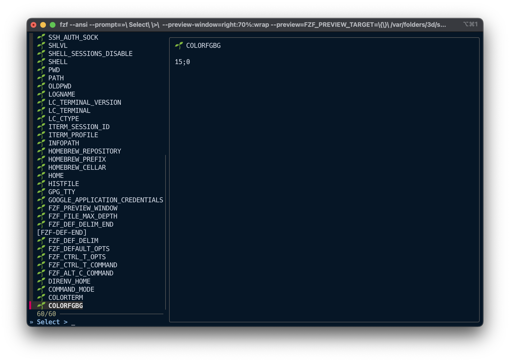
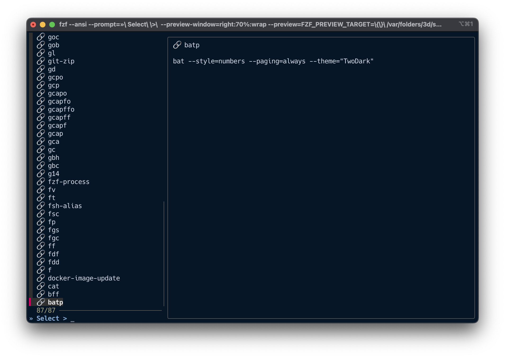
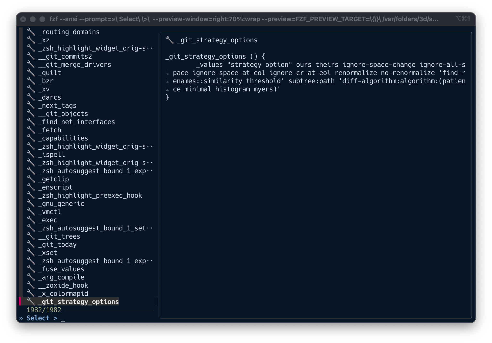
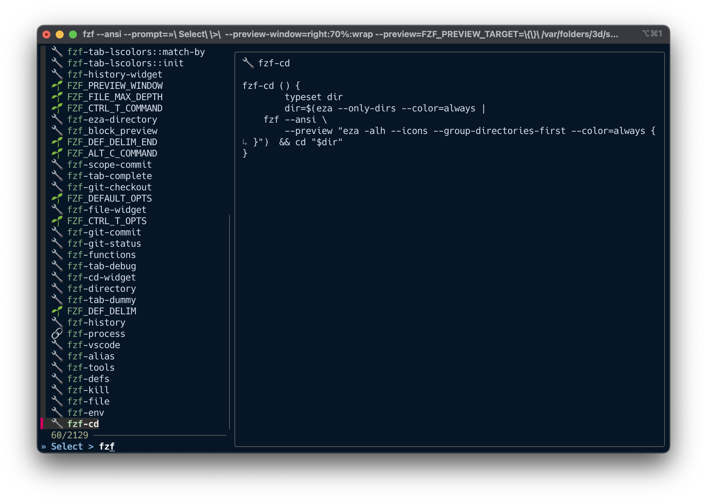
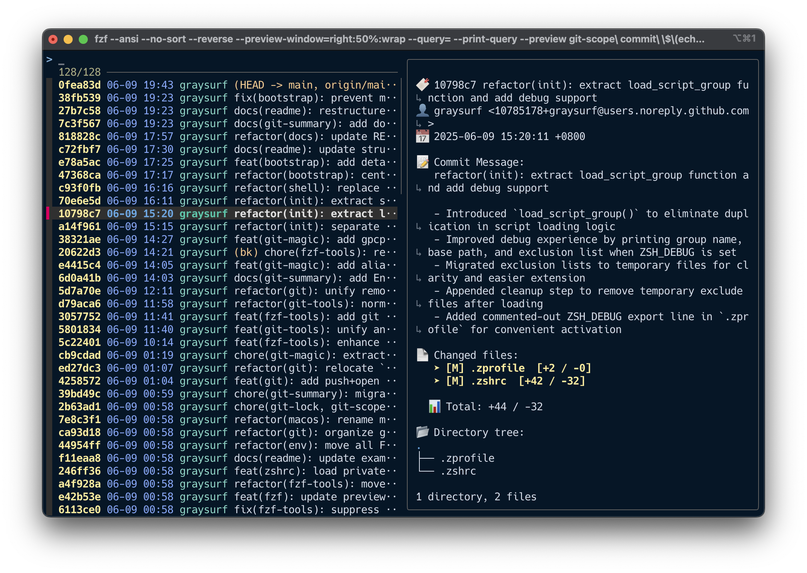
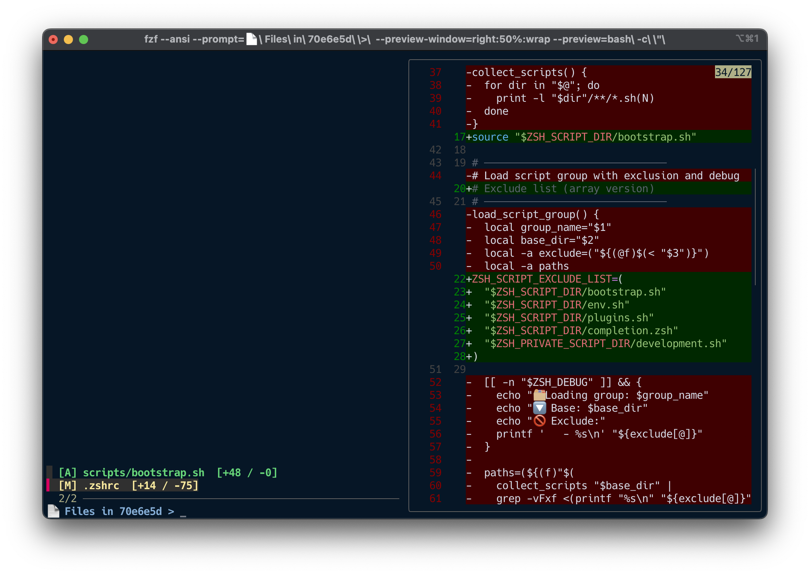

# 🚀 Fzf Tools: Interactive CLI Navigator

Fzf Tools is a modular, keyboard-driven launcher that lets you browse and act on files, Git status,
processes, and shell history using fuzzy search. It’s designed for developers who want quick,
contextual interactions directly from the terminal.

---

## 📦 Use Cases

- Open recently changed files in your editor via Git commit inspection
- Jump into any directory by previewing structure with `eza`
- Preview file contents with syntax highlighting using `bat`
- Search and replay shell history or kill processes interactively
- Integrate `fzf-tools` into aliases or scripts as a structured subcommand

---

## 🛠 Commands

### `fzf-tools env`

🌱 Browse environment variables with fuzzy search and preview

```bash
fzf-tools env
```

Each environment variable is shown with its full value for quick inspection or copying.



---

### `fzf-tools alias`

🔗 Browse and inspect defined shell aliases

```bash
fzf-tools alias
```

See your configured shortcuts in one place, with real evaluated output.



---

### `fzf-tools functions`

🔧 View loaded shell functions with source content

```bash
fzf-tools functions
```

Lists all functions in your shell session and shows their implementation.



---

### `fzf-tools defs`

📦 Explore all shell definitions (env, alias, functions)

```bash
fzf-tools defs
```

Aggregate view of your shell environment: useful for debugging or reviewing your Zsh config state.



---

### `fzf-tools git-commit`

🔍 Browse commit history, preview files in any commit, and open in VSCode

```bash
fzf-tools git-commit
```

You can enter a hash like `HEAD~1`, or interactively pick from log.

**Preview includes:**
- `bat`-highlighted file content
- Commit-specific snapshot
- Automatic temp file export to open in VSCode

### 🧭 Two-step interaction

1. **Step 1: Pick a commit**  
   Use fuzzy search to select a commit from your history.  
   The right panel previews the full commit scope (message, files, stats).

2. **Step 2: Pick a file**  
   After selecting a commit, choose a modified file.  
   The preview shows a colorized `git diff` via `delta`.  
   Upon selection, the file's snapshot is extracted and opened in VSCode.

#### 📌 Step 1: Commit selection with scope preview



#### 📄 Step 2: File selection with diff preview



> Press `Enter` to open the selected file snapshot in **VSCode**.  
> You can customize the editor by changing the command inside the script—  
> for example, replace `code` with `nvim` or any other editor you prefer.

---

### `fzf-tools git-checkout`

🌀 Checkout a previous commit using fuzzy log navigation

```bash
fzf-tools git-checkout
```

Select a past commit and checkout to it. If local changes block it, you’ll be prompted to stash.

---

### `fzf-tools git-branch`

🌿 Browse and checkout Git branches interactively with preview and confirmation

```bash
fzf-tools git-branch
```

Presents a list of local branches, sorted by most recent activity. The current branch is marked with `*`. Use fuzzy search to pick a branch.

---

### `fzf-tools git-tag`

🏷️  Browse and checkout Git tags interactively with preview and confirmation

```bash
fzf-tools git-tag
```

Lists all tags in your repository, sorted by creation date (most recent first). Use fuzzy search to select a tag.

---

### `fzf-tools history`

📜 Search and run from recent shell commands

```bash
fzf-tools history
```

Great for recalling complex or recently used one-liners without retyping.

---

### `fzf-tools file`

📝 Open a file using `vi` after previewing its contents with `bat`

```bash
fzf-tools file
```

Search for any file in your project, preview its contents with syntax highlighting, and open it in `vi` with one keystroke.

---

### `fzf-tools vscode`

🧠 Open a file in VSCode (instead of vi), with fuzzy selection

```bash
fzf-tools vscode
```

Same behavior as `fzf-tools file`, but uses your GUI editor.

---

### `fzf-tools git-status`

📂 Pick and preview modified files from `git status`

```bash
fzf-tools git-status
```

Shows inline diffs and lets you quickly inspect file changes.

---

### `fzf-tools process`

🥪 View and inspect running processes (non-interactive kill)

```bash
fzf-tools process
```

Lightweight fallback using `ps` with fuzzy search for diagnostic use.

#### 🔪 Kill mode

Add `-k` or `--kill` to enter kill mode. Selected processes will be forcefully terminated.

```bash
fzf-tools process -k
```

This runs `kill -9` on selected PID(s). Useful for terminating frozen or rogue processes.

---

### `fzf-tools directory`

📁 Fuzzy-find a directory and cd into it

```bash
fzf-tools directory
```

Previews directory contents using `eza`, or falls back to `ls`.

---

## 🧠 Summary

Fzf Tools enhances your terminal flow by bridging common developer tasks into a single,
discoverable command. With `fzf`, `bat`, `eza`, and Git integration, you get a lightweight but
powerful toolbox for navigating projects, managing sessions, and inspecting your codebase—without
leaving the shell.
