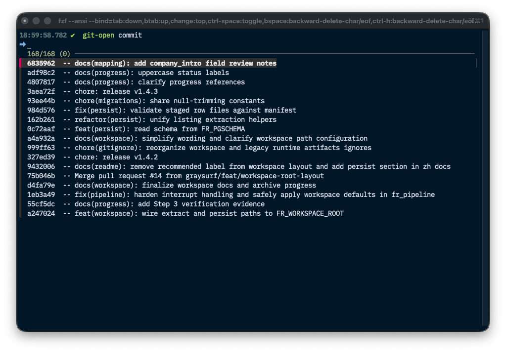
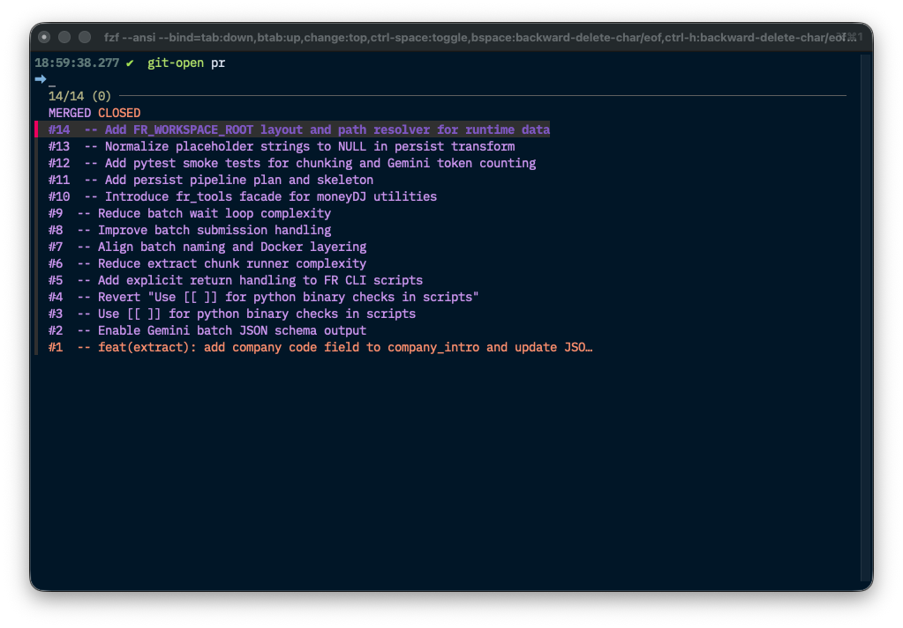

# 🔗 git-open: Open Remote Git Pages

`git-open` is a single CLI entrypoint that opens common repository pages (repo, branch, commit, PR, etc.) in your browser for the current Git repo.

## ✨ Why `git-open` (vs `gh browse`)

`git-open` and `gh browse` overlap in the sense that both ultimately open web pages, but the focus of `git-open` is the
end-to-end workflow experience:

- A single, opinionated command tree for repo navigation (`branch`, `compare`, `commits`, `file`, `blame`, `tags`, etc.)
- Provider-agnostic URL routing (GitHub/GitLab/generic) instead of GitHub-only behavior
- Git-context defaults (follow `@{u}` when it makes sense; reduce fork noise for collab pages)
- Zsh completion as a first-class feature: complete *your* `git-open` subcommands + arguments (not just flags)
- Dynamic PR number completion (via `gh pr list`) with TTL cache for fast repeated `<TAB>` usage

If you use `gho` (alias of `git-open`) with Zsh completion + fzf-tab, the differentiation becomes more about overall UX
than raw feature coverage.

---

## 📦 Use Cases

- Open the repo homepage for your current branch upstream (`git-open`)
- Jump to the default branch quickly (`git-open default-branch`)
- Open a specific branch/tag tree (`git-open branch v1.2.3`)
- Open a commit by ref (`git-open commit HEAD~1`)
- Open compare / PR / issue pages during review workflows

---

## 🧭 Remote Resolution

- Prefers the configured upstream (`@{u}`) remote and branch.
- If upstream is missing, falls back to `origin` and the current branch name.
- Remote URLs are normalized into https form (works with typical `git@...` / `ssh://...` remotes).

## 🤝 Collaboration Remote (optional)

Some `git-open` commands open repo-level “collaboration” pages (PRs, pulls, issues, Actions, releases, tags). If you want those
pages to always target a specific remote regardless of the current branch upstream, set:

```bash
export GIT_OPEN_COLLAB_REMOTE=origin
```

When set (and the remote exists), these commands prefer the collab remote repository:

- `git-open pr` (including the no-number fallback)
- `git-open pulls`
- `git-open issues`
- `git-open actions`
- `git-open releases`
- `git-open tags`

If the remote is missing, `git-open` falls back to the normal upstream resolution.

---

## 🛠 Commands

### `git-open`

Open the upstream repository homepage (same as `git-open repo`).

```bash
git-open
```

---

### `git-open repo [remote]`

Open the repo homepage for a specific remote (e.g. `origin`, `upstream`).

```bash
git-open repo
git-open repo origin
```

---

### `git-open branch [ref]`

Open the tree page for a ref (default: upstream branch).  
`ref` can be a local branch name, tag, or any ref that your provider accepts in URLs.

```bash
git-open branch
git-open branch main
git-open branch v1.2.3
```

---

### `git-open default-branch [remote]`

Open the default branch tree (remote HEAD).  
Optionally specify the remote name.

```bash
git-open default-branch
git-open default-branch upstream
```

---

### `git-open commit [ref]`

Open the commit page (default: `HEAD`). Accepts any ref that resolves to a commit.

```bash
git-open commit
git-open commit HEAD~1
git-open commit v1.2.3
```

Completion

Press `<TAB>` after `git-open commit` to browse recent commits as `"<hash>  -- <subject>"`, while inserting only the hash.



---

### `git-open compare [base] [head]`

Open the compare page (default: `<default-branch>...<upstream-branch>`).

```bash
git-open compare
git-open compare main
git-open compare main feature/my-branch
```

---

### `git-open pr [number]`

Open a PR/MR page, or (when omitted) open the “create PR/MR from current branch” page.

```bash
git-open pr
git-open pr 123
git-open pr #123
```

Completion

  Press `<TAB>` after `git-open pr` to browse PR numbers as `"#<number>  -- <title>"`. Candidates are fetched via `gh` and
  cached with a short TTL to avoid repeated API calls while you iterate.

  

Notes:

- On GitHub, `git-open pr` prefers `gh pr view --web` when available.

---

### `git-open pulls [number]`

Open the PR/MR list, or a specific PR/MR if a number is provided.

```bash
git-open pulls
git-open pulls 123
```

---

### `git-open issues [number]`

Open the issues list, or a specific issue if a number is provided.

```bash
git-open issues
git-open issues 42
```

---

### `git-open actions [workflow]`

Open GitHub Actions (GitHub-only).  
If `workflow` ends with `.yml`/`.yaml`, opens that workflow page; otherwise treats it as a query.

```bash
git-open actions
git-open actions ci.yml
git-open actions Deploy
```

---

### `git-open releases [tag]`

Open releases list, or a specific release page for a tag.

```bash
git-open releases
git-open releases v1.2.3
```

---

### `git-open tags [tag]`

Open tags list, or a specific release page for a tag.  
(To open a tag tree instead, use `git-open branch <tag>`.)

```bash
git-open tags
git-open tags v1.2.3
```

---

### `git-open commits [ref]`

Open commit history for a ref (default: upstream branch).

```bash
git-open commits
git-open commits main
```

---

### `git-open file <path> [ref]`

Open the file view at a ref (default: upstream branch).  
`path` is repo-relative; leading `./` is allowed.

```bash
git-open file README.md
git-open file scripts/git/git-open.zsh main
```

---

### `git-open blame <path> [ref]`

Open blame view at a ref (default: upstream branch).

```bash
git-open blame README.md
git-open blame scripts/git/git-open.zsh main
```

---

## 🔁 Aliases

`git-open` supports a few aliases for convenience:

- `default` → `default-branch`
- `issue` → `issues`
- `action` → `actions`
- `release` → `releases`
- `tag` → `tags`
- `history` → `commits`
- `blob` → `file`
- `prs` → `pulls`
- `pull-request`, `mr`, `merge-request` → `pr`
- `merge-requests`, `mrs` → `pulls`

Shell-level shortcuts (defined in `scripts/git/git-open.zsh`):

- `gho` → `git-open`
- `gop` → `git-open pr`
- `gopl` → `git-open pulls`
- `gob` → `git-open branch`
- `god` → `git-open default-branch`
- `goc` → `git-open commit`
- `gocs` → `git-open commits`
- `gor` → `git-open repo`
- `goi` → `git-open issues`
- `goa` → `git-open actions`
- `got` → `git-open tags`

---

## 🧱 Implementation Notes

- Implementation: `scripts/git/git-open.zsh`
- Opens URLs using `open` (macOS) or `xdg-open` (Linux).
- Provider detection is heuristic (`github`, `gitlab`, `generic`) and affects URL shapes (e.g. `/-/tree/...` on GitLab).
